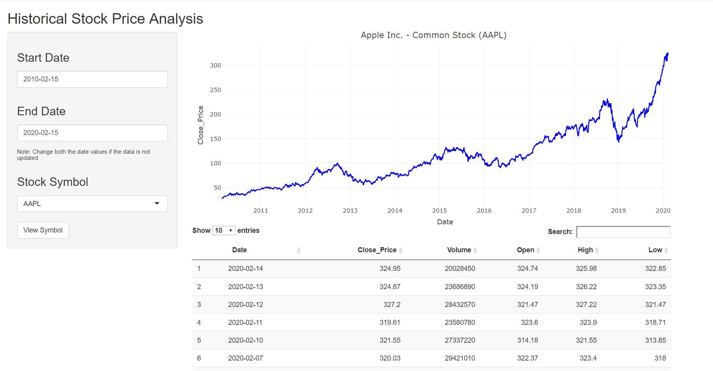

---
# nasdaq: Historical Stock Price Analysis   
<div></div>


## Description

The nasdaq pakage accept the stock details like stock name and date range values from the user and provide 
historical data up to 10 years of daily historical stock prices and volumes for each stock. Historical price trends can indicate the future direction of a stock.
<https://www.nasdaq.com/>

## Installation
```
# first install the R package "devtools" if not installed
devtools::install_github('unimi-dse/d7f30b68')
```
## Usage
```
# load the package
require(nasdaq)

# Running the shiny application
stock_view_app()

# Calling the function that just plot the data
stock_view(stock_name, start_date,end_date)

# Calling the function that returns data table for further analysis
stock_details(stock_name, start_date,end_date)

```
## User Inputs
Name  | Description
---------------|--------------
*stock name*   |Symbol of the stock
*start date*   |Initial date in YYYY-MM-DD format
*end date*     |Final date in YYYY-MM-DD format

## Dataset
The package contains a datset for all the nasdaq listed stock name and its symbols along with other useful information. Reference <http://www.nasdaqtrader.com/trader.aspx?id=symboldirdefs>
```
# To view nasdaq_listed dataset documentation
?nasdaq::nasdaq_listed
```
## stock_view_app() Preview


## stock_view() Examples
```
#To see the stock plot of Apple Inc.
stock_view("AAPL","2017-02-12","2020-01-30")

#To see the stock plot of Facebook Inc. for last 10 years
stock_view("fb")
```
## Most Popular Stocks
Symbol       | Company Name
-------------|--------------
*AAPL*       |Apple, Inc.
*SBUX*       |Starbucks, Inc.
*MSFT*       |Microsoft, Inc.
*FB*         |Facebook, Inc.
*AMZN*       |Amazon.com, Inc.
*TSLA*       |Tesla, Inc.
*QCOM*       |QUALCOMM, Inc.
*CSCO*       |Cisco Systems, Inc.

## Author
Rijin Baby 
[](https://www.linkedin.com/in/rijin-baby/)

